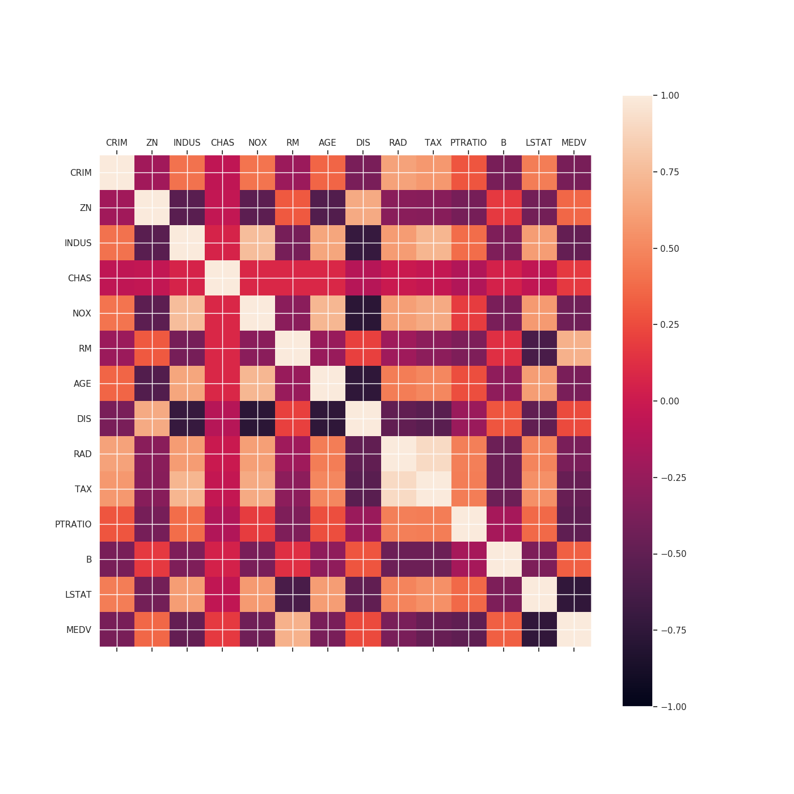
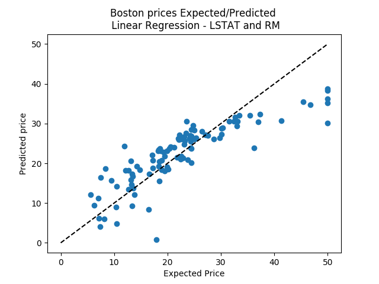
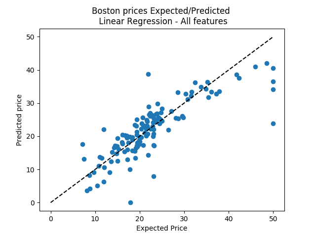
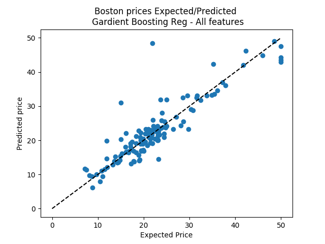

# CEBD1160_Project

| Name | Date |
|:-------|:---------------|
|Ayman Zahreddine | March 22, 2019|

-----

### Resources

- Python script used for analysis: `boston_predict.py`
- Results figures saved in: `figures/`
- Dockerfile: `Dockerfile`
- runtime-instructions in: `RUNME.md`

-----

## Research Question

How to predict housing prices using the provided dataset features or a subset of these features?

### Abstract

This project is based on the Boston Housing Dataset collected in 1978 which contains data related to houses in the city of Boston. As a part of my journey learning big data and machine learning I worked on this dataset to predict the housing prices based on the correlation between the dataset features and using statistical methods such as Linear Regression and Gradient Boosting Regressor as well as measure the performance of these predictions.

### Introduction

The Boston Housing Dataset was chosen after reviewing a number of available datasets at Scikit learn where I considered it a very suitable one to explore and analyze. The dataset can be accessed and used from the scikit-learn library [here](https://scikit-learn.org/stable/datasets/index.html#boston-house-prices-dataset). It consists of 506 sample records for 13 numeric/categorical predictive. Median Value (attribute 14) is usually the target.

| Name    | Description
| --------|--------------
| CRIM    | Per capita crime rate by town
| ZN      | Proportion of residential land zoned for lots over 25,000 sq.ft.
| INDUS   | Proportion of non-retail business acres per town
| CHAS    | Charles River dummy variable (1 if tract bounds river; 0 otherwise)
| NOX     | Nitric oxides concentration (parts per 10 million)
| RM      | Average number of rooms per dwelling
| AGE     | Proportion of owner-occupied units built prior to 1940
| DIS     | Weighted distances to five Boston employment centres
| RAD     | Index of accessibility to radial highways
| TAX     | Full-value property-tax rate per $10,000
| PTRATIO | Pupil-teacher ratio by town
| B       | 1000(Bk - 0.63)^2 where Bk is the proportion of blacks by town
| LSTAT   | % lower status of the population
| MEDV    | Median value of owner-occupied homes in $1000's
 

### Methods

In order to answer the research question multiple methods were used. First by displaying and analyzing the correlation between all features which helps determine what are the most relevant features for Linear Regression and Gradient Boosting Regressor. I useed Linear Regression because it turned out to be the first machine learning algorithm that every data scientist must comes across and it lays the foundation for other machine learning algorithms. The objective of a linear regression model is to find a relationship between one or more features(independent variables) and a continuous target variable(dependent variable) [1](https://towardsdatascience.com/linear-regression-using-python-b136c91bf0a2). Using these methods I was able to predict the prices based on all feature or a subset of features as well as measure the performance of this prediction.

### Results

To find the most meaningful features to be used for predictions using regressions, I first conducted a correlation analysis of all features. The correlation matrix below shows the relationship between features, the higher the number the stronger the correlation, whereas the signs show either a positive or a negative correlation.

After that I used Linear Regression and Gradient Boosting Regressor to predict the price based on specific features (LSTAT and RM which have 0.74 and 0.7 in correlation matrix above) and then all features.

The RMSE values for the testing came out as follows for Linear Regression:
5.05 based on LSTAT and RM 
4.51 based on all features
The RMSE for Gardient Boosting Regressor:
3.06 based on all features

This shows that price prediction using Linear Regression based on all features was better than when trying with only LSTAT and RM. On the other hand it turned out to be that using Gardient Boosting Regressor for this dataset gave a better performance.

### Discussion
Brief (no more than 1-2 paragraph) description about what you did. Include:

- interpretation of whether your method "solved" the problem
- suggested next step that could make it better.

### References
All of the reference links can be found within the document.

-------
